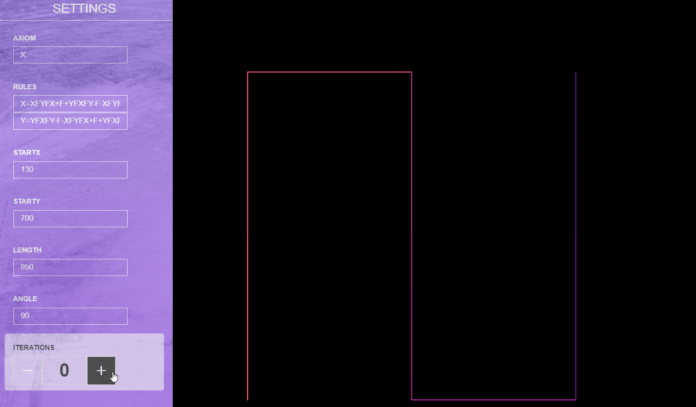

# Lindenmayer-System-Generator

##  Table of Contents
- [About](#about)
- [Demo](#demo)
- [Usage](#usage)
- [Author](#authors)
- [References](#references)

## About 
An  L-system is a parallel string rewriting system. A string rewriting system consists of an initial string, called the seed, and a set of rules for specifying how the symbols in a string are rewritten as (replaced by) strings. 

The recursive nature of the L-system rules leads to self-similarity and thereby fractal-like forms which are easy to describe with an L-system. Plant models and natural-looking organic forms 'grow' and becomes more complex by increasing the iteration level of the form.

## Demo 

## Usage 
Following character have geometric interpretation.

|Character  |      Meaning|
| ------------- |:-------------:| 
|   F	      |     Move forward by line length drawing a line|
|   f	      |     Move forward by line length without drawing a line|
|   +	      |     Turn left by turning angle|
|   -	      |     Turn right by turning angle|
|   \|	      |     Reverse direction (ie: turn by 180 degrees)|
|   \[       |      Push current drawing state onto stack|
|   \]	      |     Pop current drawing state from the stack|
  
Change the following parameters to get different systems

|Parameters| Meaning|
| ------------- |:-------------:| 
| `AXIOM`  | initial string |
| `RULES`  | rewriting rule|
| `STARTX` | canvas starting width position|
| `STARTY` | canvas starting height position|
| `LENGTH` | step size|
| `ANGLE`  | degree of direction change|

Then increase (or decrease) `ITERATIONS` to get next iteration

## Author 
- [Akash Meshram](https://github.com/akashmeshram) 

## References
- Grzegorz Rozenberg and Arto Salomaa. The mathematical theory of L systems (Academic Press, New York, 1980).
- Przemysław Prusinkiewicz, Aristid Lindenmayer – The Algorithmic Beauty of Plants.
- Kari, Lila; Rozenberg, Grzegorz; Salomaa, Arto (1997). "L Systems".
